# OpenPose human pose estimation

OpenPose is the multi-person system to jointly detect human body, hand, facial, and foot key-points (in total 135 key-points) on single images.

<div align="center">
  
  <p><em>Input image</em></p>
</div>

<div align="center">
  
  <p><em>Heat map (Confidence Maps)</em></p>
</div>

<div align="center">
  
  <p><em>Part Affinity Fields (PAFs)</em></p>
</div>

<div align="center">
  
  <p><em>Output image</em></p>
</div>

This project focused on developing an end-to-end MLOps system that integrates OpenPose human pose estimation, facilitating seamless development and production workflows. The project's structure defines two primary phases: development and production.

During the development phase, emphasis is placed on exploratory data analysis (EDA), data versioning, comprehensive model experiment tracking, localized deployment procedures, and continuous integration (CI). These components are orchestrated within an end-to-end pipeline to ensure cohesion and efficiency.

In the production phase, the focus shifts to model deployment, resources monitoring, and orchestration on Kubernetes clusters. This phase ensures the sustained efficacy of the model in operational contexts, leveraging Kubernetes' capabilities to manage deployment, scaling, and monitoring efficiently.

## Overall architecture


## Table of Contents

- [OpenPose human pose estimation](#openpose-human-pose-estimation)
  - [Overall architecture](#overall-architecture)
  - [Table of Contents](#table-of-contents)
  - [Development stage](#development-stage)
    - [1. Set up](#1-set-up)
      - [1.1. Set up environments (pyenv + poetry)](#11-set-up-environments-pyenv--poetry)
        - [1.1.1. Install pyenv and python 3.9.2](#111-install-pyenv-and-python-392)
        - [1.1.2. Install poetry](#112-install-poetry)
        - [1.1.3. Install libraries and dependencies](#113-install-libraries-and-dependencies)
      - [1.2. Install docker](#12-install-docker)
      - [1.3. Create a project in Google Cloud Platform (GCP)](#13-create-a-project-in-google-cloud-platform-gcp)
      - [1.4. Install and setup Google Cloud CLI](#14-install-and-setup-google-cloud-cli)
      - [1.5. Create Google Cloud Storage bucket](#15-create-google-cloud-storage-bucket)
    - [2. Data preparation](#2-data-preparation)
      - [2.1. Download data](#21-download-data)
      - [2.2. Generate subset of data](#22-generate-subset-of-data)
    - [3. Data version](#3-data-version)
    - [4. Explore data analysis (EDA)](#4-explore-data-analysis-eda)
    - [5. Train](#5-train)
      - [5.1. Set up MLflow Server](#51-set-up-mlflow-server)
        - [5.1.1. Access MinIO UI](#511-access-minio-ui)
        - [5.1.2. Spin up MLflow tracking server](#512-spin-up-mlflow-tracking-server)
      - [5.2. Train model](#52-train-model)
    - [6. Deploy](#6-deploy)
      - [6.1. Prepare model weight for the FastAPI application](#61-prepare-model-weight-for-the-fastapi-application)
      - [6.2. Inference FastAPI app locally](#62-inference-fastapi-app-locally)
      - [6.3. Deploy the FastAPI app to a Docker container](#63-deploy-the-fastapi-app-to-a-docker-container)
    - [7. Pipeline](#7-pipeline)
    - [8. Continuous Intergration (CI) with Jenkins (Optional)](#8-continuous-intergration-ci-with-jenkins-optional)
      - [8.1. Install Ngrok](#81-install-ngrok)
      - [8.2. Set up Jenkins](#82-set-up-jenkins)
        - [8.2.1. Run Jenkins Docker container](#821-run-jenkins-docker-container)
        - [8.2.2. Install Docker Plugins in Jenkins](#822-install-docker-plugins-in-jenkins)
        - [8.2.3. Make locally hosted Jenkins accessible from outside your network using Ngrok](#823-make-locally-hosted-jenkins-accessible-from-outside-your-network-using-ngrok)
        - [8.2.4. Add Jenkins to Github Webhooks](#824-add-jenkins-to-github-webhooks)
        - [8.2.5. Generate personal access tokens (classic)](#825-generate-personal-access-tokens-classic)
        - [8.2.6. Configure](#826-configure)
  - [Production stage](#production-stage)
    - [9. Set up](#9-set-up)
      - [9.1. Set up GCP](#91-set-up-gcp)
        - [9.1.1. Create a project in GCP](#911-create-a-project-in-gcp)
        - [9.1.2. Enabling the Kubernetes Engine API](#912-enabling-the-kubernetes-engine-api)
        - [9.1.3. Install and setup Google Cloud CLI](#913-install-and-setup-google-cloud-cli)
        - [9.1.4. Install gke-cloud-auth-plugin](#914-install-gke-cloud-auth-plugin)
        - [9.1.5. Create a service account](#915-create-a-service-account)
      - [9.2. Install terraform](#92-install-terraform)
      - [9.3. Install kubectl, kubectx and kubens](#93-install-kubectl-kubectx-and-kubens)
      - [9.4. Install helm](#94-install-helm)
      - [9.5. Connect to a Google Kubernetes Engine (GKE) cluster](#95-connect-to-a-google-kubernetes-engine-gke-cluster)
        - [9.5.1. Create the GKE cluster](#951-create-the-gke-cluster)
        - [9.5.2. Connect to the GKE cluster](#952-connect-to-the-gke-cluster)
    - [10. Deploy to GKE](#10-deploy-to-gke)
      - [10.1. Deploy Nginx Service Controller](#101-deploy-nginx-service-controller)
      - [10.2. Deploy application service](#102-deploy-application-service)
      - [10.3. Deploy minitoring service](#103-deploy-minitoring-service)

## Development stage

> **_IMPORTANT:_** All the code for the development stage is in the **development** folder. Remember to navigate to the **development** directory using the **cd** command, and checkout branch **dev** before initiating any subsequent actions.

```bash
git clone https://github.com/ToDucThanh/MLOPS-human-pose-estimation.git
cd MLOPS-human-pose-estimation/production
git checkout -b dev
```

### 1. Set up

#### 1.1. Set up environments (pyenv + poetry)

##### 1.1.1. Install pyenv and python 3.9.2

1. Update and install neccessary dependencies:

    ```bash
    sudo apt-get update
    sudo apt-get install --no-install-recommends make build-essential libssl-dev zlib1g-dev libbz2-dev libreadline-dev libsqlite3-dev wget curl llvm libncurses5-dev xz-utils tk-dev libxml2-dev libxmlsec1-dev libffi-dev liblzma-dev
    ```

    I use the zsh shell. If you use the bash shell, replace ~/.zshrc with ~/.bashrc in the following commands.

2. Install pyenv:

    ```bash
    git clone https://github.com/pyenv/pyenv.git ~/.pyenv
    echo 'export PYENV_ROOT="$HOME/.pyenv"' >> ~/.zshrc
    echo 'export PATH="$PYENV_ROOT/bin:$PATH"' >> ~/.zshrc
    ```

3. Next, add pyenv to ~/.zshrc

    ```bash
    echo -e 'if command -v pyenv 1>/dev/null 2>&1; then\n  eval "$(pyenv init -)"\nfi' >> ~/.zshrc
    ```

4. Run:

    ```bash
    exec "$SHELL"
    ```

5. Now we have installed pyenv. To check if the installation was successful or not, you can use the following command:

    ```bash
    pyenv --version
    ```

6. Install python 3.9.2

    ```bash
    pyenv install 3.9.2
    ```

7. Set a global Python version for the entire system

    ```bash
    pyenv global 3.9.2
    ```

##### 1.1.2. Install poetry

1. Install poetry with curl (RECOMMENDED)

    ```bash
    curl -sSL https://install.python-poetry.org | python -
    ```

2. Configure poetry

    ```bash
    poetry config virtualenvs.create false
    poetry config virtualenvs.in-project true
    ```

##### 1.1.3. Install libraries and dependencies

```bash
python -m venv .venv
poetry install
```

You can also install and configure pre-commit if you would like to use it:

```bash
poetry run pre-commit install
```

#### 1.2. Install docker

Install docker as instructions: [Docker installation](https://docs.docker.com/engine/install/)

We also push images to Docker Hub. You need to log in to Docker by using the following command:

```bash
docker login
```

You will be prompted to enter your Docker Hub username, password, and email address (optional). After successful authentication, you can proceed with your Docker tasks, such as pushing or pulling images from Docker Hub.

#### 1.3. Create a project in Google Cloud Platform (GCP)

- Log in to your Google Cloud Console.
- Navigate to the project creation page by clicking on the following link: [Create a project](https://console.cloud.google.com/projectcreate)
- Enter a name for your project in the designated field.
- (Optional) Customize the project ID if needed. The project ID must be unique across all GCP projects.
- Select your billing account for the project. If you don't have a billing account set up, you'll need to create one.
- (Optional) Choose your organization if you're creating the project within an organization.
- Click on the "Create" button to create your project.

After project creation, your project appears as follows:

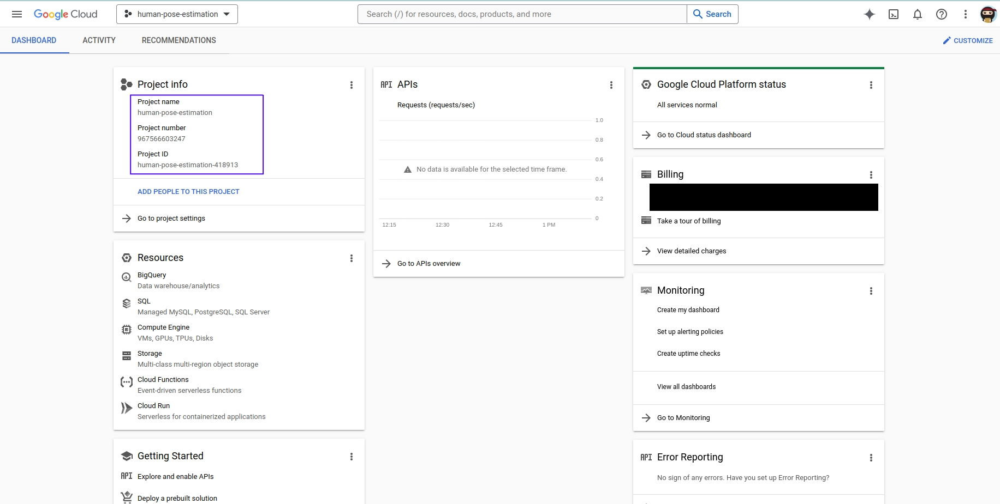

#### 1.4. Install and setup Google Cloud CLI

Google cloud (Gcloud) CLI can be installed following this document: [Gcloud CLI installation](https://cloud.google.com/sdk/docs/install). The Gcloud CLI includes the **gcloud**, **gsutil** and **bq** command-line tools.

After completing the installation process, you need to authenticate with GCP in order to access and manage resources. To do this, follow these steps:

1. Run the following command to log in to your Google Cloud account:

    ```bash
    gcloud auth login
    ```

    This command will open a browser window prompting you to log in to your Google account. Follow the instructions to complete the authentication process.

2. Next, run the following command to authenticate your application default credentials:

    ```bash
    gcloud auth application-default login
    ```

    This command will authenticate your application with your Google Cloud account using the default credentials. This is necessary for applications running on your local machine to access Google Cloud services.

Then, you'll need to initialize your Google Cloud configuration using the `gcloud init` command. This command helps you set up your default project, region, and other configurations for interacting with Google Cloud services from your local environment:

```bash
gcloud init
```

You'll be prompted to select your Google Cloud project, choose a default Compute Engine zone, and configure other settings as needed.

You can check your configuration using `gcloud config configurations list` command:


#### 1.5. Create Google Cloud Storage bucket

- Log in to your Google Cloud account.
- Navigate to bucket creation page: [Create a bucket](https://console.cloud.google.com/storage/create-bucket)
- Configure the bucket settings:
  - Name: Enter a globally unique name for your bucket. Bucket names must be unique across all of Google Cloud Storage. My bucket name is: `human-pose-data-bucket`.
  - Location: Choose the location where you want to store your data. This determines the region where your data will physically reside. In this project, I decided to use Region `asia-southest1`.
  - Storage class: Select the storage class that best fits your use case (e.g., Standard, Nearline, Coldline). In this project, I decided to use `Standard`.
  - Choose additional options: Configure additional options such as access control, object versioning, and logging. In this project, I decided to use `Soft Delete` and `Object Versioning`.
- Click Create: Review your settings and click the "Create" button to create your bucket.

The bucket is already created:

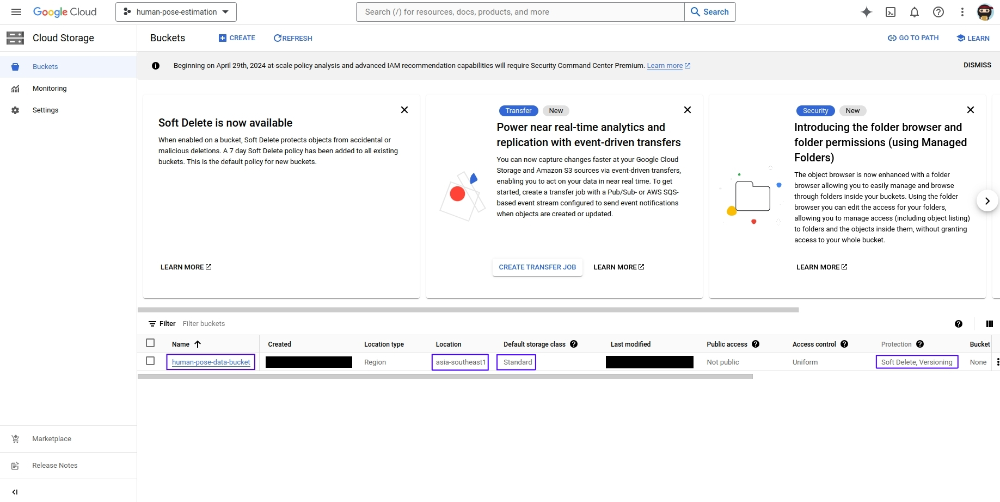

### 2. Data preparation

#### 2.1. Download data

The data of this project is the COCO 2014 dataset. You can run the script `download_data.sh` to download the data.

- _**Option 1**_ (If you have access to a GPU with high computational power and memory bandwidth, unfortunately, it's not available to me. 😢)

  ```bash
  bash download_data.sh
  ```

  The bash script `download_data.sh` is provided below:

  ```bash
  #!/bin/bash

  data_dir="./data/raw"

  val_data_link="http://images.cocodataset.org/zips/val2014.zip"
  train_data_link="http://images.cocodataset.org/zips/train2014.zip"

  target_val_data_path="$data_dir/val2014.zip"
  target_train_data_path="$data_dir/train2014.zip"

  label_link="https://www.dropbox.com/s/0sj2q24hipiiq5t/COCO.json?dl=1"
  target_label_path="$data_dir/label.json"

  mask_data_link="https://www.dropbox.com/s/bd9ty7b4fqd5ebf/mask.tar.gz?dl=0"
  mask_data_path="$data_dir/mask.tar.gz"


  if [ ! -d "$data_dir" ]; then
      mkdir -p "$data_dir"
  fi


  ## Download label file
  if [ ! -f "$target_label_path" ]; then
      wget -O "$target_label_path" "$label_link"
  fi

  ## Download mask data
  if [ ! -f "$mask_data_path" ]; then
      wget -O "$mask_data_path" "$mask_data_link"
      tar -xzvf "$mask_data_path" -C "$data_dir"
  fi

  ## Download and unzip val data
  if [ ! -f "$target_val_data_path" ]; then
      wget -O "$target_val_data_path" "$val_data_link"
      unzip "$target_val_data_path" -d "$data_dir"
  fi

  ## Download and unzip train data
  if [ ! -f "$target_train_data_path" ]; then
      wget -O "$target_train_data_path" "$train_data_link"
      unzip "$target_train_data_path" -d "$data_dir"
  fi
  ```

  The dataset includes four parts: mask data, labels, training data, and validation data. The training and validation data sets are large, so if your internet connection is slow, you can manually download them via the following links:

  - train data: [train_data_link](http://images.cocodataset.org/zips/train2014.zip) (~12.6GB)
  - validation data: [valid_data_link](http://images.cocodataset.org/zips/val2014.zip) (~6.2GB)

- _**Option 2**_ (if your resources are limited) (RECOMMENDED)

  With this option, we only download the validation COCO 2014 dataset. We will split the data in val2014 dataset into training and validation dataset. You can **comment out the code for downloading and unzipping** the train data in the bash script `download_data.sh` above and then run it, or manually download if your internet connection is slow.

========= This project will continue with option 2 😊 =========

After finishing downloading the data, our data will be organized as the following structure:

```bash
├── data/
│   ├── raw/
│   │   ├── mask/
│   │   │
│   │   │
│   │   ├── val2014/
│   │
│   │
│   ├── label.json
```

#### 2.2. Generate subset of data

We generate a subset of the data for faster experimentation. \
Example: Generating subset label data using only first 100 images.

```bash
poetry run python generate_subset_label_data.py --num_samples 100
```

Now our data structure will be:

```bash
├── data/
│   ├── raw/
│   │   ├── mask/
│   │   │
│   │   │
│   │   ├── val2014/
│   │
│   │
│   ├── label.json
│   ├── label_subset.json
```

### 3. Data version

We will use DVC to version data. DVC pushs the metadata files and references (such as checksums or hash values) that represent the data to a remote. In this project the remote is Google Cloud Storage bucket we created in [Create Google Cloud Storage bucket](#15-create-google-cloud-storage-bucket). Additionally, we also tag each data version with a release tag.

Remember to replace the `dvc_remote_url` inside [config.yaml](development/config/config.yaml) with your GCS bucket


If this is the first time you are executing this data versioning process, simply run the following command in your terminal:

```bash
make version-data-first
```

If this is the first time running the data versioning process, you will observe the following outcomes:


Release tag on github:


Data pushed to Google Cloud Storage bucket:


After your first time, whenever you need to version new changes to your data, execute the following command:

```bash
make version-data
```

### 4. Explore data analysis (EDA)

Run the following command to open jupyter lab at `localhost:8888`

```bash
make jupyter
```

You can refer to this notebook [explore_data.ipynb notebook](development/explore_data.ipynb) to explore the data and perform EDA, possibly to gain a better understanding of the dataset's structure, contents, and any potential insights it may offer.

### 5. Train

#### 5.1. Set up MLflow Server

To track the training experiments, we'll spin up the MLflow server. The backend storage of this tracking server is Postgres and the artifact storage is MinIO. Before start up the server, we first need to generate `MINIO_ACCESS_KEY` and `MINIO_SECRET_ACCESS_KEY`.

##### 5.1.1. Access MinIO UI

Run the following command to access the MinIO UI at `localhost:9001`:

```bash
make minio
```


The username and password are stored in the [.env file](development/.env)


Steps to generate the `MINIO_ACCESS_KEY` and `MINIO_SECRET_ACCESS_KEY`:

- Access `localhost:9001`.
- Navigate to Access Keys page.
- Click Create access key and create.
- Replace your `MINIO_ACCESS_KEY` and `MINIO_SECRET_ACCESS_KEY` with the ones in [.env file](development/.env).


##### 5.1.2. Spin up MLflow tracking server

Run the following command to access the Mlflow UI at `localhost:5001`:

```bash
make mlflow
```

#### 5.2. Train model

Now is the moment we've all been waiting for: (TRAINING!!!!!🔥). First, let's delve into some configurations for the training experiment.


As discussed above, we proceed with option 2 in [Download data](#21-download-data) and use only subset of data generated in [Generate subset of data](#22-generate-subset-of-data) (the first 100 images from val2014/ dataset) for faster experimentation.

Run the following command to start training:

```bash
make train
```

> **_NOTE:_**  Since I've enabled system metric logging for Mlflow (by setting MLFLOW_ENABLE_SYSTEM_METRICS_LOGGING=true in the .env file) to measure GPU metrics, the training process will take some time to start. If you don't need to measure GPU metrics, you can turn it off by uncommenting this line in the [task_train.py](development/task_train.py) script:\
> os.environ["MLFLOW_ENABLE_SYSTEM_METRICS_LOGGING"] = "false"

We can see all runs of the experiment at `localhost:5001`:


Model metrics:

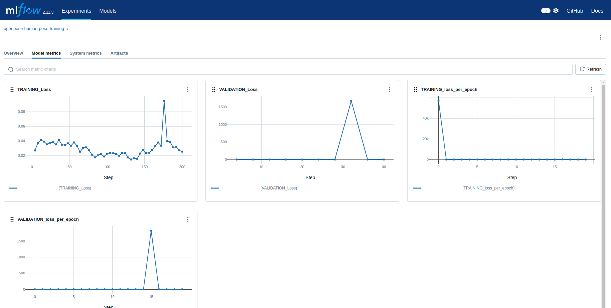

System metrics:


We can also view the artifacts saved in MinIO storage:


### 6. Deploy

#### 6.1. Prepare model weight for the FastAPI application

Run the following command to download the weight from MinIO and save it to the folder [src/weights](development/src/weights/). This weight will be used by FastAPI to make predictions.

```bash
make download-weight
```

The mechanism of how the download process works:

- Identification of Finished Runs: Initially, the script scans through all runs marked as 'FINISHED' within the designated experiment, `openpose-human-pose-training` from mlflow. You can adjust the experiment name via the [config/config.yaml file](development/config/config.yaml). Note that this experiment is automatically created during the training phase.

- Download and Storage: Upon identification, the system retrieves the weight associated with the minimum validation loss (val_loss) and stores it in the [src/weights](development/src/weights/) directory.

- Validation Check for Download: Additionally, the download process is triggered only if the val_loss of the current weight in the [src/weights](development/src/weights/) directory (if it already exists) is equal to or greater than that of the new model weight from MinIO. For further insights and implementation details, refer to the script [development/task_download_best_weight_from_minio.py](development/task_download_weight_from_minio.py).

#### 6.2. Inference FastAPI app locally

Run the followling command to start the FastAPI server at `localhost:8000`:

```bash
make app-local
```

Navigate to `http://localhost:8000` in your web browser to access your FastAPI app locally. You can send an image and get the predictions:


#### 6.3. Deploy the FastAPI app to a Docker container

You can also use a Docker container to deploy the FastAPI application. Run the following command and open `localhost:8000` to perform inference:

```bash
make app-docker
```

> **_NOTE:_** If you do not see any predictions on the response image, it is understandable because we only trained on a small subset of the data. You can download the weight from the following link and put it in the [src/weights](development/src/weights/) directory to obtain the result.

Link download: [weight](https://drive.google.com/file/d/1Jvhhwcc7Hqlzcs5nbuQMpkxlNYtKujtb/view?usp=drive_link)

### 7. Pipeline

The pipeline include several tasks metioned above: data versioning, model training, weight validation and image pushing to Docker Hub. All these tasks run sequentially.

- Data versioning ([Part 3. Data version](#3-data-version)): This task ensures that the data used for model training is appropriately versioned. If there is a new data version, it will push hashed data to Google Cloud Storage and release a tag on GitHub.
- Model training ([Part 5. Train](#5-train)): This task trains the OpenPose model with tracking from the MLflow server.
- Weight validation: This task checks the model metrics and downloads weights from MinIO if they meet certain conditions.
- Image pushing to Docker Hub: This task receives the status from the Weight Validation task to determine whether to push a new image to Docker Hub.

Run the followling command to start the whole pipeline:

```bash
make pipeline
```

### 8. Continuous Intergration (CI) with Jenkins (Optional)

#### 8.1. Install Ngrok

- Follow the link to install Ngrok: [install ngrok](https://ngrok.com/download)
- Sign up for the account: [https://dashboard.ngrok.com/signup](https://dashboard.ngrok.com/signup)
- Follow the instructions to add your authtoken.

#### 8.2. Set up Jenkins

##### 8.2.1. Run Jenkins Docker container

Run the following command to spin up Jenkins:

```bash
make jenkins
```

Next steps:

- Open your web browser and navigate to `http://localhost:8081`. You'll be prompted to unlock Jenkins by providing an initial admin password.
- Get initial admin password: To retrieve the initial admin password, run the following command in your terminal:

    ```bash
    docker exec jenkins-container cat /var/jenkins_home/secrets/initialAdminPassword
    ```

- Complete setup: Follow the on-screen instructions to complete the setup wizard. You can install recommended plugins or choose to install plugins later.
- Create an admin user: After plugin installation, create an admin user for Jenkins.
- Once the setup is complete, you can start using Jenkins.

##### 8.2.2. Install Docker Plugins in Jenkins

We will use Docker to run CI in Jenkins. Follow the steps below to install these plugins.

- Navigate to Jenkins Dashboard and go to **Manage Jenkins**.
- In the **Manage Jenkins** section, click on **Manage Plugins**.
- Navigate to the **Available** tab, which lists all available plugins that can be installed.
- Search for _Docker Pipeline_ and _Docker plugin_ and install them.
- Click on the "Install without restart" button. This will download and install the selected plugin(s) without requiring a Jenkins restart.


##### 8.2.3. Make locally hosted Jenkins accessible from outside your network using Ngrok

Run the following command:

```bash
ngrok http http://localhost:8081
```

##### 8.2.4. Add Jenkins to Github Webhooks

Once you've made your Jenkins instance accessible via Ngrok, you can configure GitHub webhooks to trigger Jenkins builds automatically whenever there are new commits or pull requests pushed to your repository.

- **Payload URL**: `Ngrok url` + `github-webhook/`. Example: `https://ac53-2405-4803-ed32-c86b-f737-d778.ngrok-free.app/github-webhook/`
- **Content type**: application/json
- **Let me select individual events**: pull requests, pushes

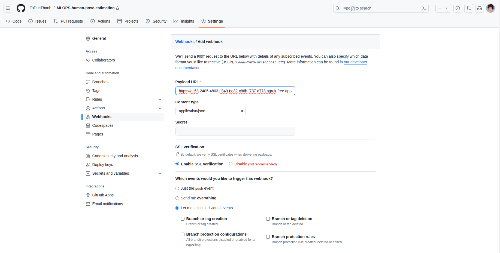

##### 8.2.5. Generate personal access tokens (classic)


##### 8.2.6. Configure

- Create the Multibranch Pipeline

    

- Configure the Multibranch Pipeline

    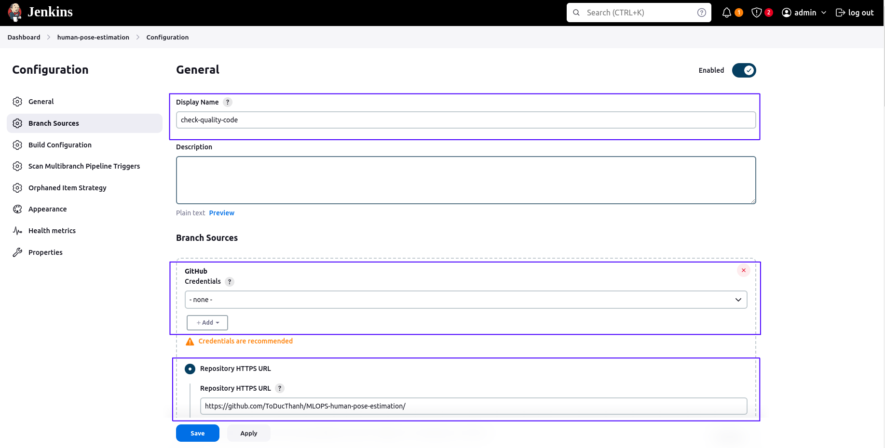

- Add credential (personal access token) created at [Generate personal access tokens (classic)](#825-generate-personal-access-tokens-classic) to **Password**.

    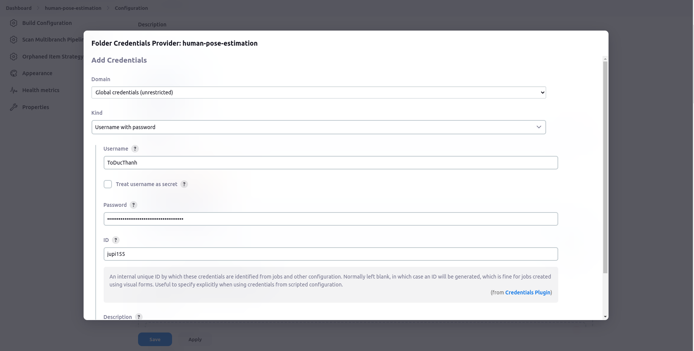

    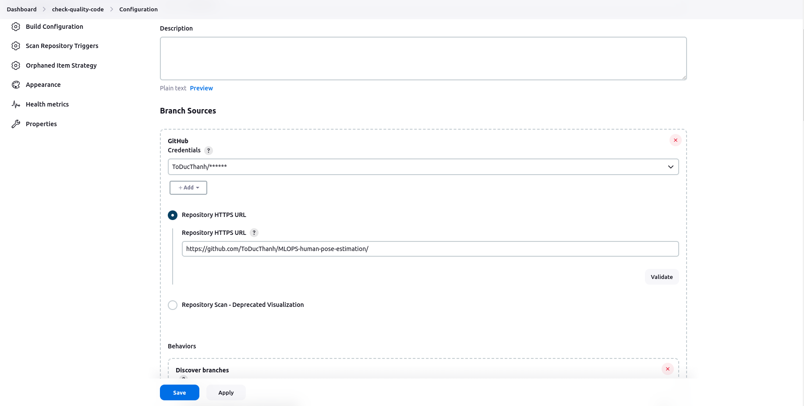

- Modify Github API usage rate limit

    

After completing the setup, every time you push or create a pull request, Jenkins will trigger and check your code quality (based on the rules in the [Jenkinsfile](Jenkinsfile)). If all checks pass, your push or pull request will proceed.

## Production stage

> **_IMPORTANT:_** All the code for the development stage is in the **production** folder. Remember to navigate to the **production** directory using the **cd** command before initiating any subsequent actions.

```bash
# Clone git if you have not done it.
git clone https://github.com/ToDucThanh/MLOPS-human-pose-estimation.git
cd MLOPS-human-pose-estimation/production
```

### 9. Set up

#### 9.1. Set up GCP

##### 9.1.1. Create a project in GCP

Refer to [Create a project in Google Cloud Platform (GCP)](#13-create-a-project-in-google-cloud-platform-gcp) in development stage.

##### 9.1.2. Enabling the Kubernetes Engine API

Navigate to the following link to enable Kubernetes Engine API: [Kubernetes Engine API](https://console.cloud.google.com/apis/library/container.googleapis.com)


##### 9.1.3. Install and setup Google Cloud CLI

Refer to [Install and setup Google Cloud CLI](#14-install-and-setup-google-cloud-cli) in development stage.

##### 9.1.4. Install gke-cloud-auth-plugin

Run the following command in your terminal:

```bash
sudo apt-get install google-cloud-cli-gke-gcloud-auth-plugin
```

##### 9.1.5. Create a service account

- Navigate to [Service acounts](https://console.cloud.google.com/iam-admin/serviceaccounts) and click "CREATE SERVICE ACCOUNT".
- Select `Kubernetes Engine Admin` role.
- Create new key as json type for your service account. Download this json file and save it in [terraform/.credentials](production/terraform/.credentials) directory. Update **credentials** in [terraform/main.tf](production/terraform/main.tf) with your json directory.
- Navigate to [IAM](https://console.cloud.google.com/iam-admin/iam) and click on "GRANT ACCESS". Then, add new principals; this principal should be your service account. Finally, select the `Owner` role.

After completion, this is the result:

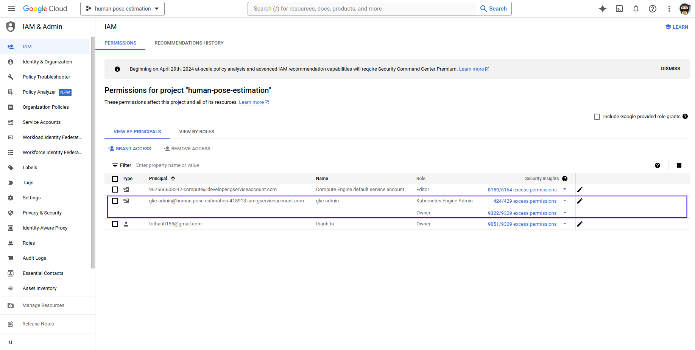

#### 9.2. Install terraform

- Download terraform as instructions via this link: [Download terraform](https://developer.hashicorp.com/terraform/tutorials/aws-get-started/install-cli)
- Get terraform version and update **required_version** in [terraform/main.tf](production/terraform/main.tf)

    

#### 9.3. Install kubectl, kubectx and kubens

Kubectl, kubectx, and kubens are tools that can help with navigating clusters and namespaces in Kubernetes. Kubectl is a command-line tool that can be used to deploy applications, inspect resources, and view logs. Kubectx and kubens can help with faster context switching, which can reduce the need for manual command modifications.

- Install kubectl: [kubectl](https://kubernetes.io/docs/tasks/tools/install-kubectl-linux/)
- Install kubectx and kubens: [kubectx and kubens](https://github.com/ahmetb/kubectx#manual-installation-macos-and-linux)

#### 9.4. Install helm

Helm helps you manage Kubernetes applications — Helm Charts help you define, install, and upgrade even the most complex Kubernetes application.

- Install helm: [helm](https://helm.sh/docs/intro/install/)

#### 9.5. Connect to a Google Kubernetes Engine (GKE) cluster

##### 9.5.1. Create the GKE cluster

Update your **project_id** in [terraform/variables.tf](production/terraform/variables.tf) and then, run the following command:

```bash
cd terraform
terraform init
terraform plan
terraform apply
```

The GKE cluster I configured has 1 node and its machine is "e2-standard-4" (4 CPU and 16 GB Memory)


##### 9.5.2. Connect to the GKE cluster

- Navigate to [GKE UI](https://console.cloud.google.com/kubernetes/list)
- Click on the vertical ellipsis icon and choose "Connect". A popup window will appear, displaying options to connect to the cluster as follow:

    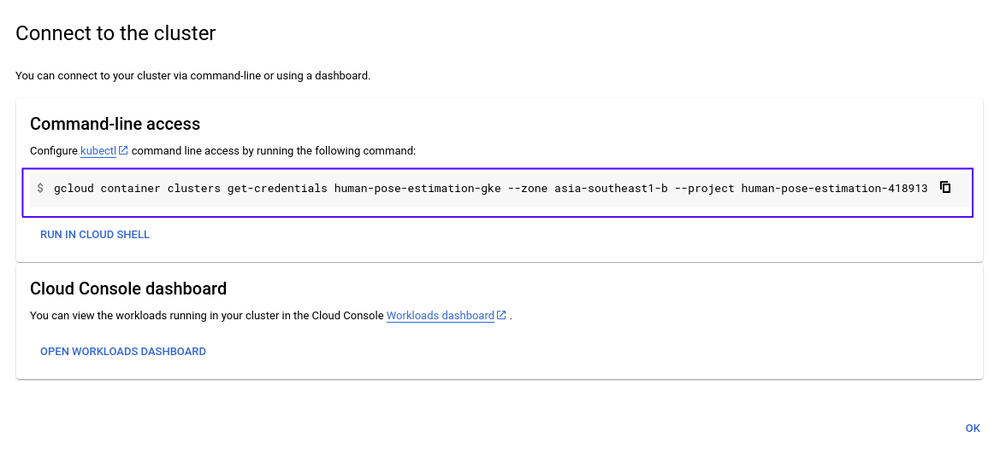

- Copy and run the command in the terminal:

    ```bash
    gcloud container clusters get-credentials [YOUR CLUSTER] --zone [YOUR REGION] --project [YOUR PROJECT ID]
    ```

- Check the connection from local using `kubectx`

    

### 10. Deploy to GKE

#### 10.1. Deploy Nginx Service Controller

> **_TIP:_** I set an alias 'k' for 'kubectl' for faster typing. 😆

```bash
alias k='kubectl'
```

NGINX Ingress Controller is a popular solution used in Kubernetes environments to manage incoming traffic to applications running in the cluster. It serves as a load balancer, routing external traffic to the appropriate services within the Kubernetes cluster based on defined rules and configurations.

Run the following command to deploy it:

```bash
cd helm_charts/nginx_ingress
k create ns nginx-ingress # Create the namespace nginx-ingress
kubens nginx-ingress # Switch to namespace nginx-ingress
helm upgrade --install nginx-ingress-controller .
```

Verify if the pod is running in the namespace **nginx-ingress**:


> **_IMPORTANT:_** Our application receives images through Nginx Ingress routing. Typically, these images are in MB (e.g., 10 MB). To accommodate large image sizes without encountering a '413 Entity Too Large' error, we must configure Nginx Ingress accordingly.

We can configure the size in [production/helm_charts/nginx_ingress/values.yaml](production/helm_charts/nginx_ingress/values.yaml):


#### 10.2. Deploy application service

We will deploy the FastAPI app to GKE in the namespace **model-serving**. It will be deployed with a NodePort type (nginx ingress will route requests to this service) and maintained by a Deployment with 2 replica pods.

```bash
cd helm_charts/app
k create ns model-serving
kubens model-serving
helm upgrade --install pose-estimation-app .
```

Wait several minutes until it deployed sucessfully.

Now, we will test the app, do the following steps:

- Obtain the IP address of nginx-ingress

    ```bash
    k get ing
    ```

- Add the domain name `human-pose-estimation.com` of this IP to /etc/hosts where the hostnames are mapped to IP addresses.

    ```bash
    sudo nano /etc/hosts
    [YOUR_INGRESS_IP_ADDRESS] human-pose-estimation.com
    ```

    Example:

    ```nano
    35.240.217.148 human-pose-estimation.com
    ```

- Open a web browser and navigate to `human-pose-estimation.com/docs` to access the FastAPI app. Now we can test the app

    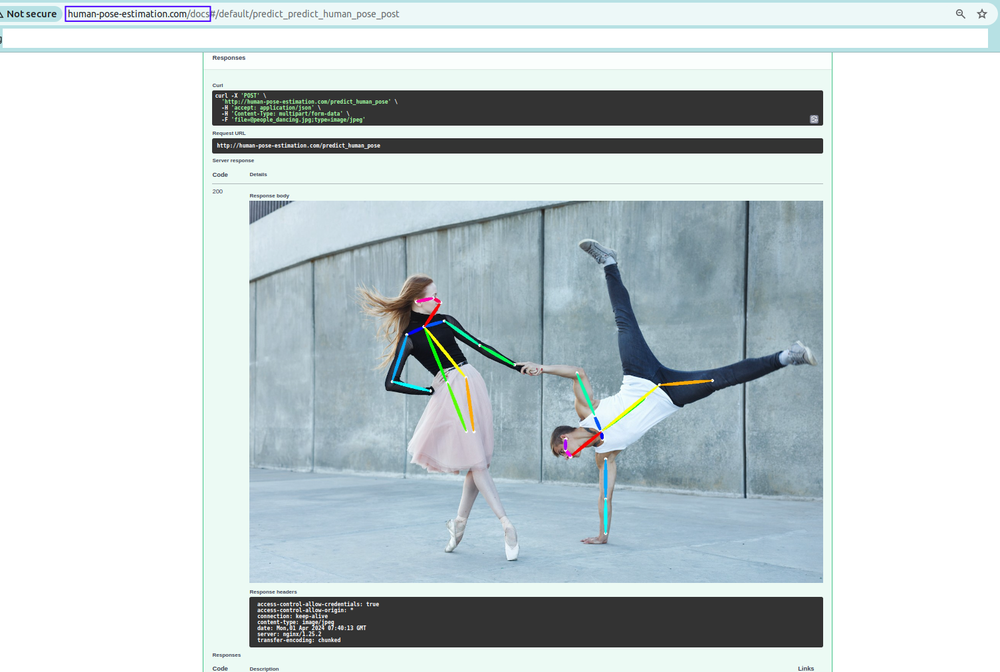

#### 10.3. Deploy minitoring service

We use `kube-prometheus-stack` to deploy a monitoring solution for the Kubernetes cluster. This stack, provided by the Prometheus community, includes various components such as Prometheus, Grafana, Alertmanager, and other Prometheus ecosystem tools configured to monitor the health and performance of your cluster's resources.

Run these commands to deploy;

```bash
helm repo add prometheus-community https://prometheus-community.github.io/helm-charts
helm repo update
cd helm_charts/prometheus/kube-prometheus-stack
k create ns monitoring
kubens monitoring
helm upgrade --install kube-grafana-prometheus .
```

Add all the services of the IP to /etc/hosts

```bash
sudo nano /etc/hosts
[YOUR_INGRESS_IP_ADDRESS] human-pose-estimation.com
[YOUR_INGRESS_IP_ADDRESS] grafana.monitor.com
[YOUR_INGRESS_IP_ADDRESS] prometheus.monitor.com
[YOUR_INGRESS_IP_ADDRESS] alertmanager.monitor.com
```

Example:

```nano
35.240.217.148 human-pose-estimation.com
35.240.217.148 grafana.monitor.com
35.240.217.148 prometheus.monitor.com
35.240.217.148 alertmanager.monitor.com
```

Access the corresponding domain names to reach the service. The default username and password is **admin** and **prom-operator**.

How monitoring works: Prometheus will scape metrics from both nodes and pods within the GKE cluster. Grafana will then visualize this data, presenting metrics such as CPU and RAM usage for system health monitoring. Alerts regarding system health will be forwarded to Slack.

To send alert information to Slack, we need a Slack Webhook URL. You can follow the steps via this [link](https://sankalpit.com/plugins/documentation/how-to-create-slack-incoming-webhook-url/?ref=anaisurl.com) to create one.

Replace your slack api url in [production/helm_charts/prometheus/kube-prometheus-stack/values.yaml](production/helm_charts/prometheus/kube-prometheus-stack/values.yaml)

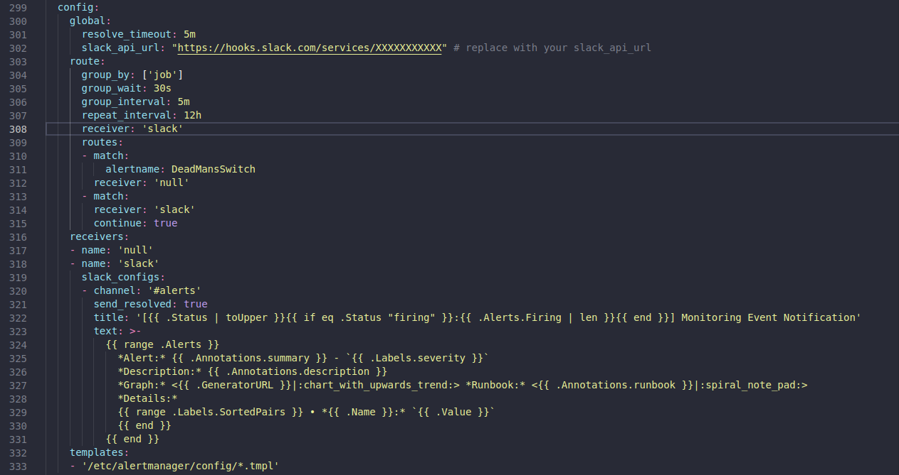

Grafana dashboard:

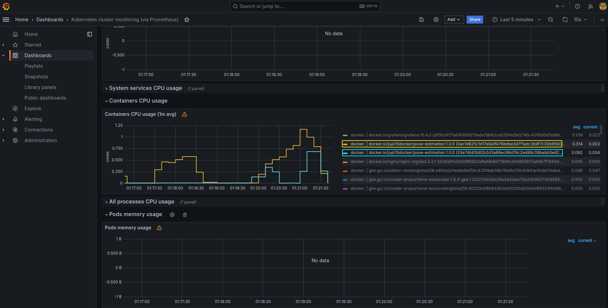

Prometheus dashboard:

- RAM usage:

    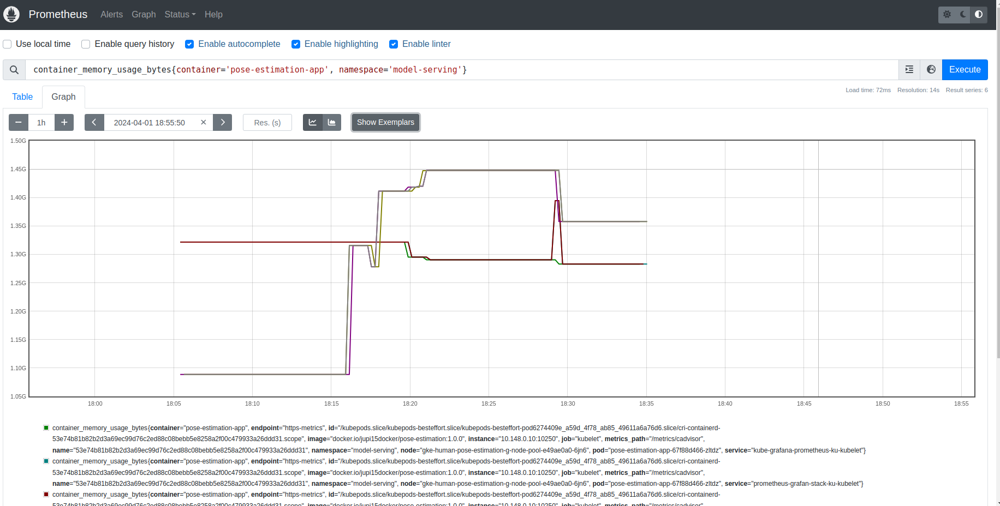

- CPU usage:

    
